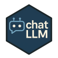

<!-- README.md is generated from README.Rmd. Please edit that file -->

# chatLLM <a href="https://knowusuboaky.github.io/chatLLM/"></a>

<!-- badges: start -->

[](https://opensource.org/licenses/MIT)
[](https://github.com/knowusuboaky/chatLLM/actions/workflows/R-CMD-check.yaml)
[](https://knowusuboaky.github.io/chatLLM/)
[](https://cran.r-project.org/package=chatLLM)
[](https://cranlogs.r-pkg.org/badges/grand-total/chatLLM)
[](https://github.com/knowusuboaky/chatLLM/commits/main)
[](https://github.com/knowusuboaky/chatLLM/issues)

<!-- badges: end -->

## Overview

**chatLLM** is an R package providing a single, consistent interface to
multiple “OpenAI‑compatible” chat APIs (OpenAI, Groq, Anthropic,
DeepSeek, Alibaba DashScope, Gemini, Grok, GitHub Models, AWS Bedrock,
Azure OpenAI, and Azure AI Foundry).

Key features:

- 🔄 **Uniform API** across providers
- 🗣 **Multi‑message context** (system/user/assistant roles)
- 🔁 **Retries & backoff** with clear timeout handling
- 🔈 **Verbose control** (`verbose = TRUE/FALSE`)
- ⚙️ **Discover models** via `list_models()`
- 🏗 **Factory interface** for repeated calls
- 🌐 **Custom endpoint** override and advanced tuning

------------------------------------------------------------------------

## Installation

From CRAN:

``` r
install.packages("chatLLM")
```

Development version:

``` r
# install.packages("remotes")  # if needed
remotes::install_github("knowusuboaky/chatLLM")
```

------------------------------------------------------------------------

## Setup

Set your API keys or tokens once per session:

``` r
Sys.setenv(
  OPENAI_API_KEY       = "your-openai-key",
  GROQ_API_KEY         = "your-groq-key",
  ANTHROPIC_API_KEY    = "your-anthropic-key",
  DEEPSEEK_API_KEY     = "your-deepseek-key",
  DASHSCOPE_API_KEY    = "your-dashscope-key",
  GH_MODELS_TOKEN      = "your-github-models-token",
  GEMINI_API_KEY       = "your-gemini-key",
  XAI_API_KEY          = "your-grok-key",
  AWS_ACCESS_KEY_ID    = "your-aws-access-key",
  AWS_SECRET_ACCESS_KEY = "your-aws-secret-key",
  AWS_REGION           = "us-east-1",
  AZURE_OPENAI_KEY     = "your-azure-openai-key",
  AZURE_OPENAI_ENDPOINT = "https://your-resource.openai.azure.com",
  AZURE_FOUNDRY_KEY    = "your-azure-foundry-key",
  AZURE_FOUNDRY_ENDPOINT = "https://your-foundry-endpoint"
)
```

------------------------------------------------------------------------

## Usage

### 1. Simple Prompt

``` r
response <- call_llm(
  prompt     = "Who is Messi?",
  provider   = "openai",
  max_tokens = 300
)
cat(response)
```

### 2. Multi‑Message Conversation

``` r
conv <- list(
  list(role    = "system",    content = "You are a helpful assistant."),
  list(role    = "user",      content = "Explain recursion in R.")
)
response <- call_llm(
  messages          = conv,
  provider          = "openai",
  max_tokens        = 200,
  presence_penalty  = 0.2,
  frequency_penalty = 0.1,
  top_p             = 0.95
)
cat(response)
```

### 3. Verbose Off

Suppress informational messages:

``` r
res <- call_llm(
  prompt      = "Tell me a joke",
  provider    = "openai",
  verbose     = FALSE
)
cat(res)
```

### 4. Factory Interface

Create a reusable LLM function:

``` r
# Build a “GitHub Models” engine with defaults baked in
GitHubLLM <- call_llm(
  provider    = "github",
  max_tokens  = 60,
  verbose     = FALSE
)

# Invoke it like a function:
story <- GitHubLLM("Tell me a short story about libraries.")
cat(story)
```

### 5. Discover Available Models

``` r
# All providers at once
all_models <- list_models("all")
names(all_models)

# Only OpenAI models
openai_models <- list_models("openai")
head(openai_models)
```

### 6. Call a Specific Model

Pick from the list and pass it to `call_llm()`:

``` r
anthro_models <- list_models("anthropic")
cat(call_llm(
  prompt     = "Write a haiku about autumn.",
  provider   = "anthropic",
  model      = anthro_models[1],
  max_tokens = 60
))
```

------------------------------------------------------------------------

## Troubleshooting

- **Timeouts**: increase `n_tries` / `backoff` or supply a custom
  `.post_func` with higher `timeout()`.
- **Model Not Found**: use `list_models("<provider>")` or consult
  provider docs.
- **Auth Errors**: verify your API key/token and environment variables.
- **Network Issues**: check VPN/proxy, firewall, or SSL certs.

------------------------------------------------------------------------

## Contributing & Support

Issues and PRs welcome at <https://github.com/knowusuboaky/chatLLM>

------------------------------------------------------------------------

## License

MIT © [Kwadwo Daddy Nyame Owusu -
Boakye](mailto:kwadwo.owusuboakye@outlook.com)

------------------------------------------------------------------------

## Acknowledgements

Inspired by **RAGFlowChainR**, powered by **httr** and the R community.
Enjoy!
